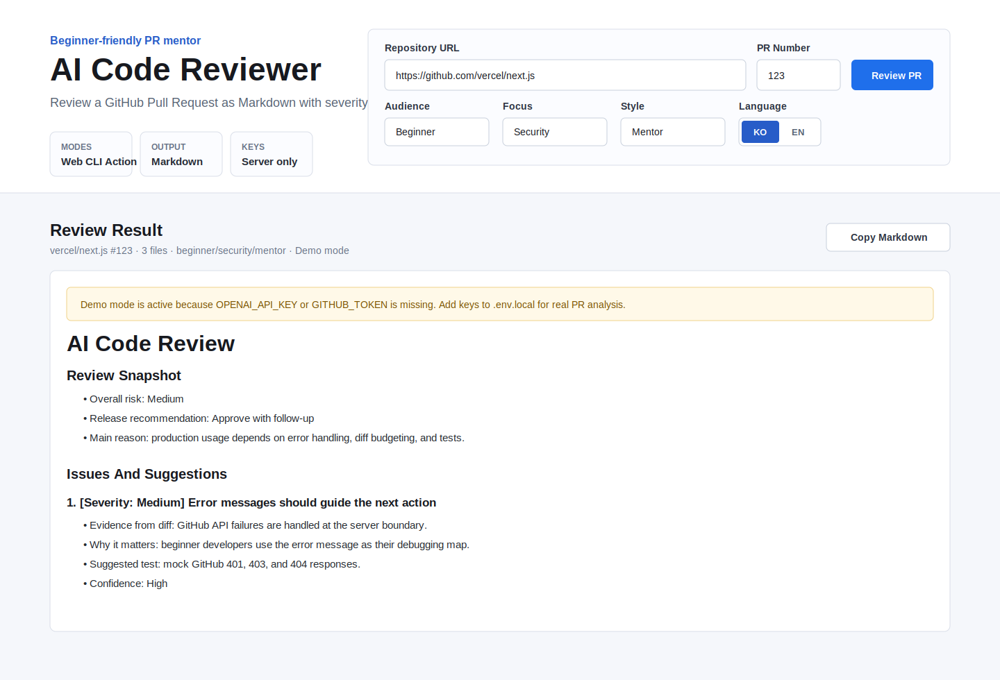

# DiffMentor

[English](README.md) | [한국어](README.ko.md)

DiffMentor는 GitHub Pull Request의 변경 사항(diff)을 읽고, 초보자도 이해할 수 있는 코드 리뷰를 Markdown으로 생성하는 AI PR 멘토입니다.

단순히 "문제가 있다"라고 말하는 리뷰어가 아니라, 왜 문제인지, 어떤 상황에서 실패할 수 있는지, 어떻게 고치면 좋은지, 어떤 테스트를 추가하면 좋은지까지 설명하는 것을 목표로 합니다.



## 주요 기능

- Next.js와 Tailwind CSS 기반 웹 UI
- API 키를 클라이언트에 노출하지 않는 서버 전용 API 처리
- GitHub REST API로 Pull Request 변경 파일과 diff 가져오기
- OpenAI API 기반 Markdown 코드 리뷰 생성
- API 키 없이도 흐름을 볼 수 있는 데모 모드
- 리뷰 대상 수준 선택: beginner, intermediate, senior
- 리뷰 초점 선택: general, security, performance, frontend, testing
- 출력 언어 선택: Korean 또는 English
- 리뷰 스타일 선택: mentor, checklist, strict
- CLI 실행 지원
- GitHub Actions로 PR 댓글 자동 작성
- 긴 diff를 위한 토큰 절약형 길이 제한

## 동작 방식

1. 사용자가 GitHub 저장소 URL과 Pull Request 번호를 입력합니다.
2. 서버가 URL에서 `owner/repo`를 추출합니다.
3. GitHub REST API로 PR의 변경 파일 목록과 patch diff를 가져옵니다.
4. 각 파일의 patch를 AI 리뷰 입력 형태로 정리합니다.
5. diff가 너무 길면 파일별/전체 길이를 제한합니다.
6. 사용자가 선택한 리뷰 옵션을 적용합니다.
7. OpenAI API가 위험도, 문제점, 수정 제안, 테스트 제안, 학습 노트를 포함한 Markdown 리뷰를 생성합니다.
8. 웹에서는 Markdown을 렌더링하고, CLI에서는 터미널에 출력하며, GitHub Actions에서는 PR 댓글로 남길 수 있습니다.

API 키는 서버 API Route, CLI 프로세스, GitHub Actions 러너에서만 사용됩니다. 브라우저 클라이언트에는 `OPENAI_API_KEY`와 `GITHUB_TOKEN`이 전달되지 않습니다.

## 리뷰 품질 기준

DiffMentor는 단순 챗봇이 아니라 실제 코드 리뷰에 가까운 결과를 만들도록 프롬프트가 설계되어 있습니다.

- 제공된 diff에 근거해서만 리뷰합니다.
- 문맥이 부족하면 추측하지 않고 확인할 수 없는 부분을 명시합니다.
- blocking 이슈와 일반 개선 제안을 분리합니다.
- 실제 운영 영향도를 기준으로 Low, Medium, High 심각도를 부여합니다.
- 왜 문제인지 설명합니다.
- 어떤 상황에서 실패할 수 있는지 예시를 듭니다.
- 구체적인 수정 방향을 제안합니다.
- 추가하면 좋은 테스트를 제안합니다.
- 각 이슈의 확신도(Confidence)를 표시합니다.
- 초보자가 배울 수 있는 개념을 함께 설명합니다.

## 기술 스택

- Frontend: Next.js, React, TypeScript
- Styling: Tailwind CSS
- Backend: Next.js API Route
- GitHub API: REST API
- AI API: OpenAI API
- CLI: Node.js
- Markdown rendering: react-markdown

## 설치 방법

```bash
git clone https://github.com/Daehyun10/Diffmentor.git
cd Diffmentor
npm install
```

## 환경 변수 설정

프로젝트 루트에 `.env.local` 파일을 만들고 아래 값을 입력합니다.

```env
OPENAI_API_KEY=your_openai_api_key_here
GITHUB_TOKEN=your_github_personal_access_token_here
OPENAI_MODEL=gpt-4.1-mini
```

`OPENAI_MODEL`은 선택 사항입니다. API 키가 없으면 실제 GitHub/OpenAI API를 호출하지 않고 데모 모드로 동작합니다.

## 웹 앱 실행

```bash
npm run dev
```

브라우저에서 접속합니다.

```txt
http://localhost:3000
```

데모 모드로 바로 열기:

```txt
http://localhost:3000/?demo=1
```

## CLI 사용

외부 API 호출 없이 데모 실행:

```bash
npm run cli -- --repo vercel/next.js --pr 123 --demo
```

실제 PR 리뷰:

```bash
OPENAI_API_KEY=your_key GITHUB_TOKEN=your_token npm run cli -- --repo vercel/next.js --pr 123
```

로컬 diff 파일 리뷰:

```bash
npm run cli -- --repo your-name/your-repo --pr 1 --diff-file changes.diff
```

PR 댓글로 리뷰 남기기:

```bash
npm run cli -- --repo your-name/your-repo --pr 12 --post-comment
```

옵션:

```bash
--audience beginner|intermediate|senior
--focus general|security|performance|frontend|testing
--language ko|en
--style mentor|checklist|strict
--output review.md
--quiet
```

## GitHub Actions 사용

다른 저장소에 아래 워크플로우를 추가하면 Pull Request가 열릴 때 DiffMentor가 자동으로 리뷰 댓글을 남깁니다.

```yaml
name: DiffMentor

on:
  pull_request:
    types: [opened, synchronize, reopened]

permissions:
  contents: read
  pull-requests: read
  issues: write

jobs:
  review:
    runs-on: ubuntu-latest
    steps:
      - uses: actions/checkout@v4
      - uses: Daehyun10/Diffmentor@main
        env:
          OPENAI_API_KEY: ${{ secrets.OPENAI_API_KEY }}
        with:
          audience: beginner
          focus: general
          language: ko
          style: mentor
```

## 차별점

대부분의 AI 코드 리뷰 도구는 문제를 찾는 데 집중합니다. DiffMentor는 리뷰 과정에서 개발자가 배울 수 있도록 설명하는 데 집중합니다.

- 초보자 친화적인 설명
- 실제 실패 상황과 영향도 설명
- 수정 예시와 테스트 제안 포함
- 웹, CLI, GitHub Actions 모두 지원
- 보안, 성능, 프론트엔드, 테스트 중심 리뷰 모드
- Markdown 출력으로 다양한 환경에서 사용 가능

## 앞으로 추가하면 좋은 기능

- 파일/라인 단위 인라인 PR 코멘트
- OpenAI 비용 절감을 위한 리뷰 캐싱
- `diffmentor.config.json` 기반 팀별 리뷰 규칙
- UI에서 심각도별 필터링
- 저장소 히스토리 기반 리뷰
- GitLab, Bitbucket 지원
- SARIF export 지원
- 여러 AI 모델 제공자 지원

## 라이선스

MIT
